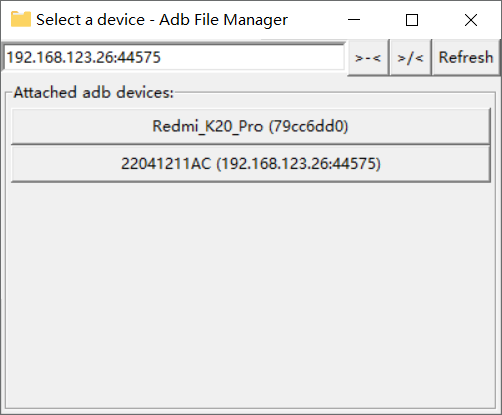
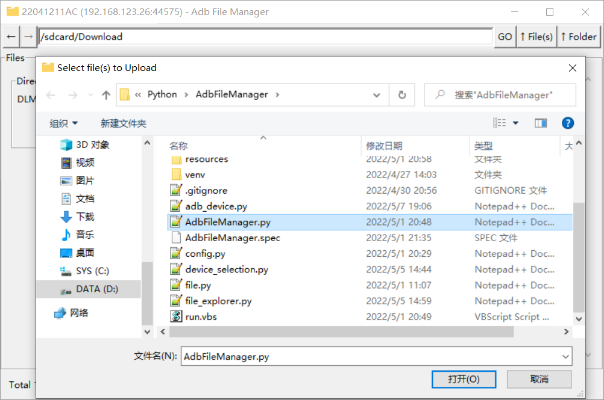
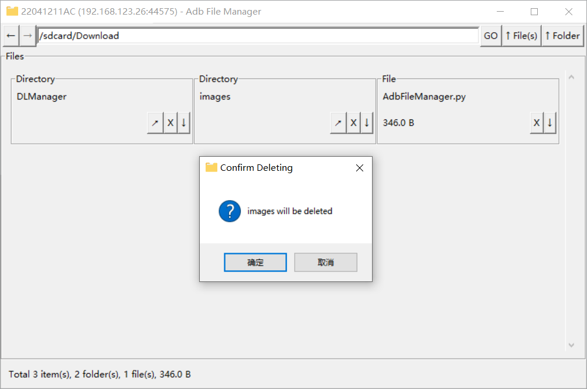

AdbFileManager
==========

Graphic file manager based on `Android Debug Bridge`.  
A Python beginner's project.

Usage
-----
Double click `run.vbs` should work fine on Windows machines, Windows adb already bundled, this method does not show logs.
Other platforms see the following steps.

1. Download and configure [**Android SDK Platform-Tools**](https://developer.android.google.cn/studio/releases/platform-tools)
on your machine.
2. Run `python AdbFileManager.py`.  
  
You can delete the files under `./resources/bin` if you have Android SDK Platform-Tools configured on your machine.

Screenshots
-----
Address bar for wireless connection.  
  

Uploading.  
   

Deleting.  
  

FAQ
---
_Q: Why adb?_

A: It's just an option. You can connect your android via cable or Wi-Fi using adb tools.
I code this just for practicing Python.
